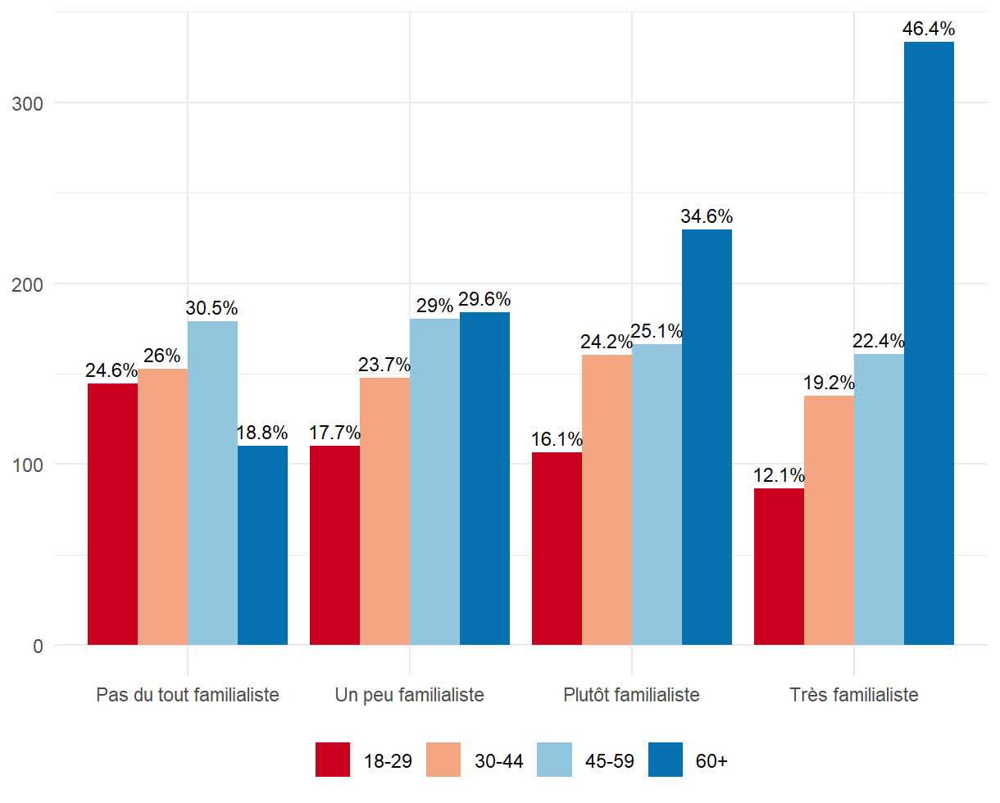
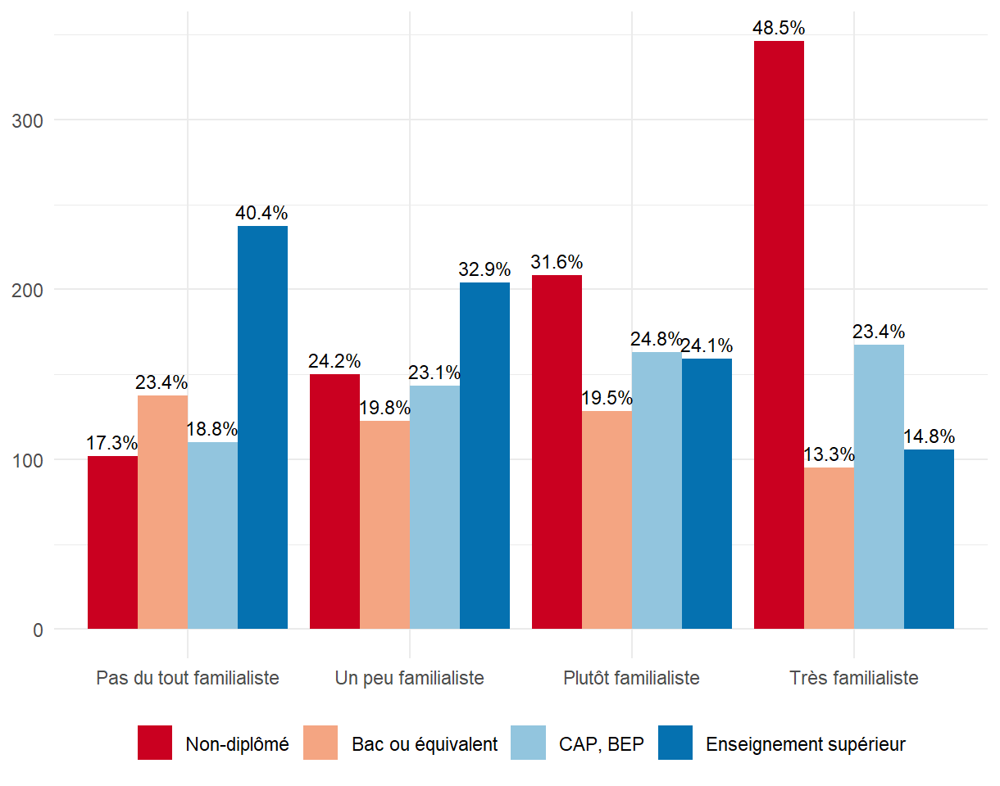

# france_traditional_values
# Traditional Family Values and Institutional Trust in France 🇫🇷

📊 This project analyzes the relationship between adherence to traditional family values and levels of institutional trust (in the State and the Church) among French adults, based on data from the 2018 wave of the European Values Study (EVS).

## 🎯 Research Context

Historically, family values in France have been shaped by state-led pronatalist and familialist discourse, especially during the interwar period. The state promoted an ideal of motherhood as a national duty, which deeply influenced value systems across generations.

In this context, traditional values (marriage, children, abortion, divorce) are not only personal beliefs but also social constructs rooted in institutional ideologies.

## 🔍 Research Questions

1. Is trust in the State or the Church correlated with stronger adherence to traditional family values?
2. How do life experience variables (age, education, marital status, number of children) influence these values?

## 🧰 Methods & Data

- Data source: EVS 2018 (France sample, ages 18+)
- Tools: R (data prep, Multiple Correspondence Analysis, visualizations)
- Key variable construction: Family values index based on MCA of questions about marriage, children, divorce, abortion

## ✨ Key Findings

- Institutional trust matters — but in different ways:
  - Trust in the Church correlates positively with adherence to traditional and pronatalist values.
  - Trust in the State (particularly social welfare institutions) is also linked, but political trust in government remains low across the population.
- Life experience strongly impacts value alignment:
  - Age, education level, marital status, and number of children are significantly associated with traditional value adherence.
- The two dimensions — trust and life experience — are themselves correlated.

## 📊 Visual Insights

### 🧓 Age and Family Values

Older individuals are significantly more likely to support traditional family values. Nearly half of the most familialist respondents are seniors (46%), while young people dominate the least familialist group. This pattern reflects generational differences rather than just age — older generations were more exposed to state-promoted pronatalist discourse.

### 🎓 Education and Family Values

The higher the education level, the lower the likelihood of supporting familialist views. Nearly half (48%) of the very familialist group have no diploma, while university graduates are overrepresented among those rejecting traditional family norms. Education seems to foster openness to alternative family models.

We propose a revised model:  
> Traditional value adherence is shaped simultaneously by individual life experience and institutional trust patterns.

## 📁 Project Structure

- analysis.R: Full R script used for data cleaning, analysis, and visualization
- report.pdf: Full analytical article in French
- visuals/: Folder with figures and charts from the analysis

## 🗂️ Data Source

- European Values Study 2018  
  [https://europeanvaluesstudy.eu/](https://europeanvaluesstudy.eu/)

---

🧠 Author: Aleksandra Zemlianaia
🎓 Sociology MA, Université Paris Cité
📬 Feel free to connect or reach out for collaboration!
